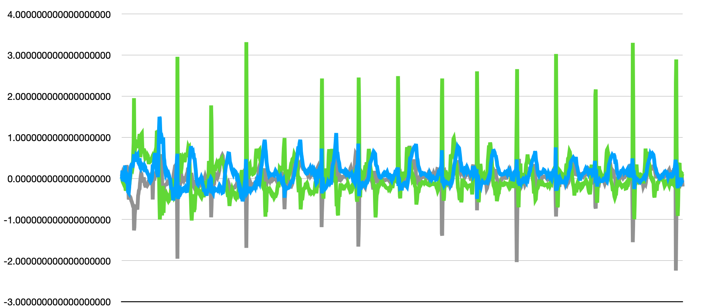
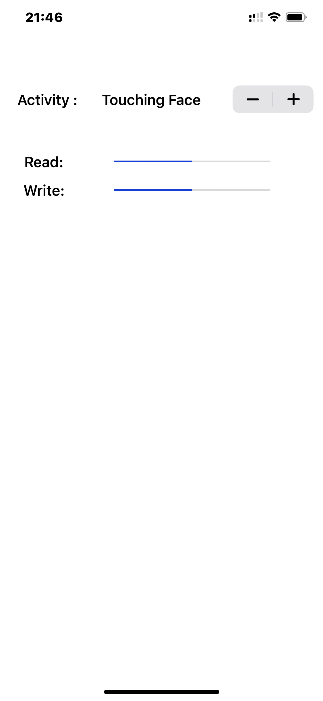
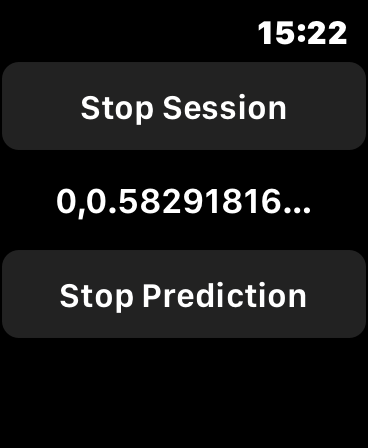

### This Apple Watch app detects when you start washing your hands and warns you if you stop too soon.

Detection of hand washing in the background and notification if the process is too short. CoreML and the trained NN model 
are used to detect this process. The app can also collect data from the accelerometer and gyroscope for this training. 
Data is transferred to the iphone, where it is stored as a CSV file. Then you can move it to your computer and use Turi Create (https://github.com/apple/turicreate) to convert it to a CoreML model.

The app runs in the background and does not need to be started before washing your hands.
But this also creates a problem, because WatchOS only allows you to use one workout session at a time.It is not possible to start two workouts at the same time, so you need to restart the app after a normal workout.

There is also a problem with battery consumption. 
Obviously, an app that constantly reads the accelerometer and uses the prediction process once per second
(however, this process should not be heavy) consumes relatively significant battery life.

There are a few features that I would like to draw attention to

1. In order for the app to work in the background all the time, it should use HKWorkoutSession
<pre>
  self.session = try HKWorkoutSession( healthStore: self.healthStore, configuration: configuration)
</pre>
here you should keep in mind that immediately after starting the session you need to pause it
<pre>

			self. session?.startActivity(with: Date())
			self.session?.pause()
</pre>

In this case, motion updates will continue to arrive, but the Health Store  will not take into account the time and calories. 
It can be done about the same thing by starting a session
This can be done in much the same way by starting a session without HKHealthStore (depricated) but in this case the application will not be updated in background .

2.  Performing a prediction 2.5 times per second reduces the battery powwer by about 1% every 15 minutes.

3. Detecting hand washing is fairly reliable, as opposed to raising hands to face
Raising the hand (depending on body position and speed) lasts 0.5-1 seconds (application receives update 50 times per second). The graph shows that raising your hands is a clearly recognizable action (especially after lowering arm), but it is a lifting process that is almost indistinguishable from other activities (walking or taking something off a shelf, etc.). The reliability and speed of such detection do not allow  to use it comfortably.

  

4 The application has two buttons the first one allows you to collect information from sensors and transmit it to the phone which automatically saves it to a file along with the activity type selected on the phone and another will test CoreML model .

  
  
  

